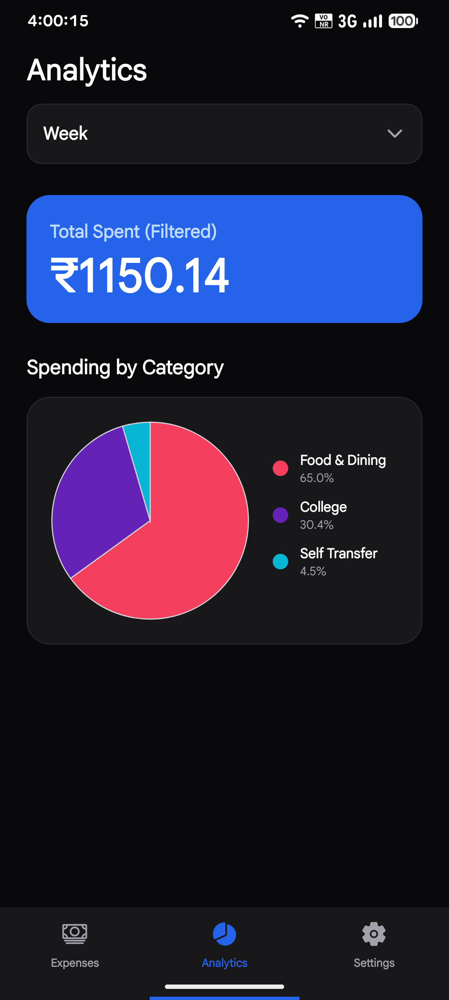
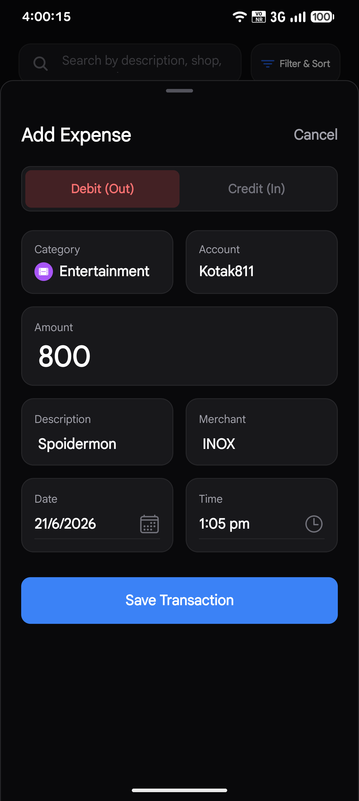
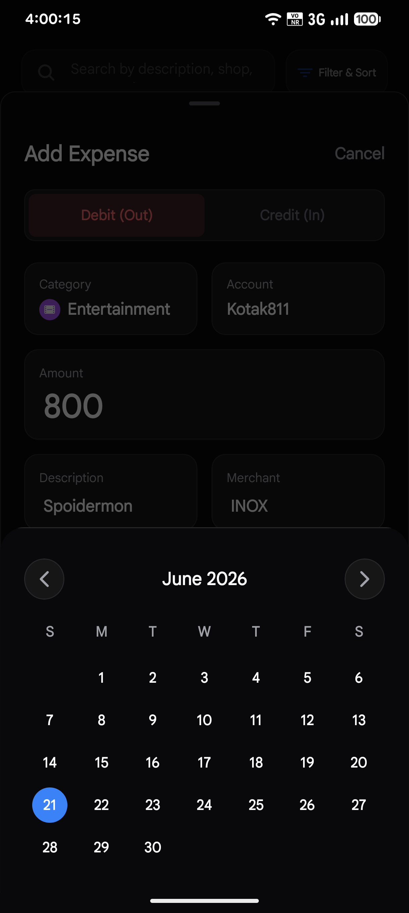
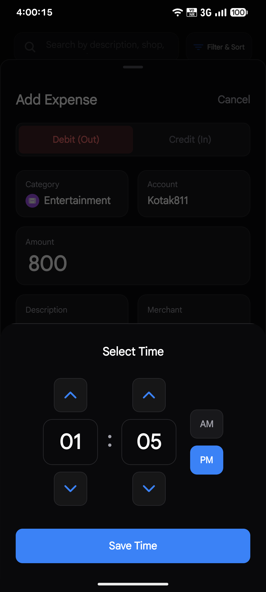
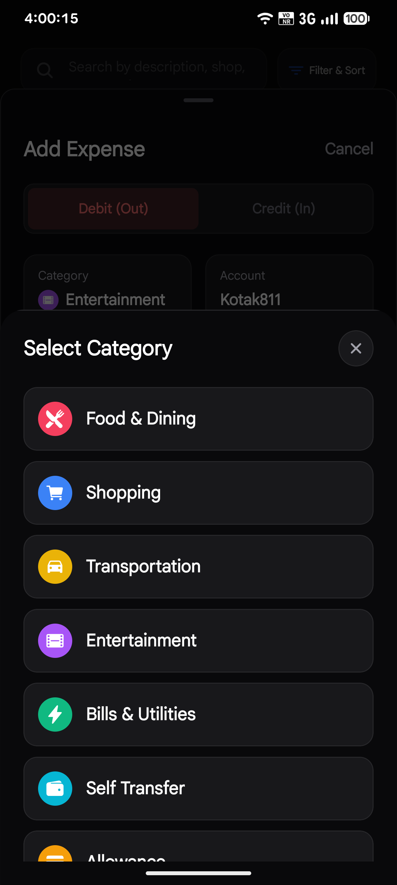
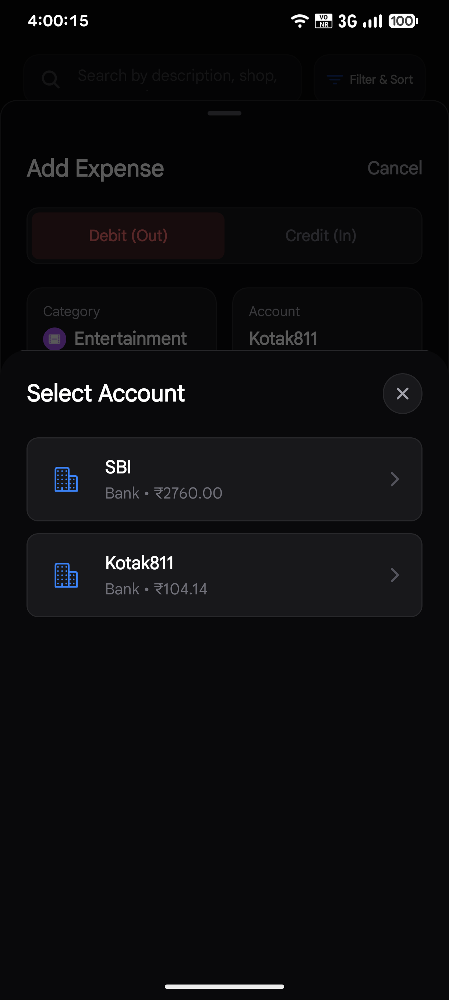
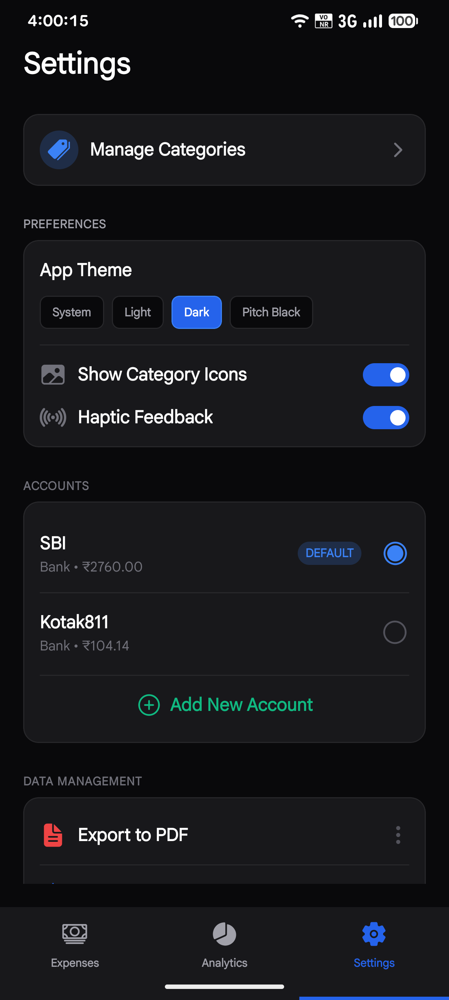
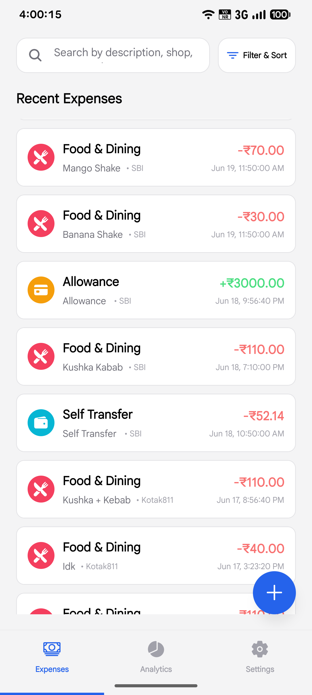
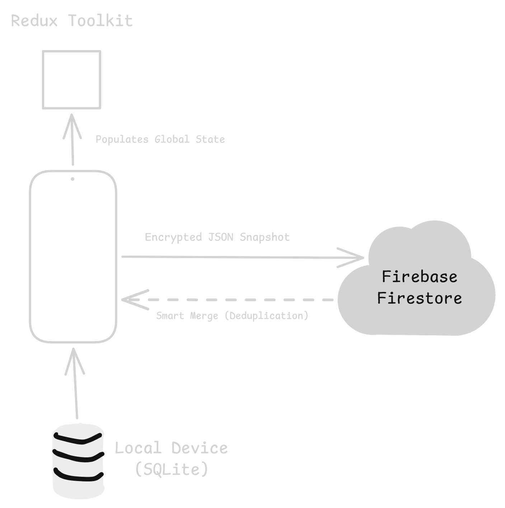

# LedgerLite


> **Note:** This is an independent learning project engineered from the ground up to demonstrate production-grade mobile architecture. It focuses heavily on **Offline-First Data Persistence, High-Performance List Rendering, and Complex Dual-Sync Cloud Algorithms.**

LedgerLite is a high-performance, offline-first personal finance management application. It allows users to track expenses, manage multiple localized wallets, categorize transactions dynamically, and securely synchronize their local databases to the cloud via a custom Smart Merge engine.

---

## UI Showcase

<p align="center">
  
  
  
  
</p>

<p align="center">
  
  
  
  
</p>

---

## Key Features

### Offline-First by Design
LedgerLite treats the local device as the absolute source of truth. The application is completely functional without an internet connection. Every feature—from creating accounts to filtering transaction histories—happens synchronously on the device with zero network latency.

### Multi-Account & Wallet Tracking
Users are not restricted to a single monolithic balance. LedgerLite allows the creation of infinite custom accounts (e.g., Checking, Savings, Credit Cards, Cash). Each account maintains its own isolated running balance while still contributing to the global net worth calculation.

### Dual-Sync Cloud Backup & Smart Merge
While the app is offline-first, users can opt into Firebase Authentication to synchronize their SQLite database to the cloud. When restoring data to a new device, the system utilizes a custom "Smart Merge" algorithm. Rather than blindly overwriting data, it compares timestamps, amounts, and descriptions to surgically inject missing records and skip duplicates.

### Advanced Multi-Dimensional Filtering
Transactions can be searched fuzzily by description or filtered through complex multi-dimensional queries. Users can isolate transactions by specific date ranges, transaction types (Income vs. Expense), and exact category associations instantly.

### Complete Data Portability
Users hold complete ownership of their financial data. The application features a robust data management hub where the SQLite database can be instantly exported locally as a Raw JSON backup, an Excel (`.xlsx`) spreadsheet, or a CSV file for desktop analysis.

### Strict NativeWind Theme Engine
The application fully implements Tailwind CSS via NativeWind, wired directly into a custom React Context. This allows for instantaneous, flawless transitions between Light Mode and Dark Mode across the entire application without frame drops.

---

## The Engineering Philosophy: Architecture Deep Dive

The architectural goal of LedgerLite was to avoid the "Loading Spinner" anti-pattern prevalent in modern React Native applications. By utilizing the local device as the absolute Source of Truth, all network-bound state management is eliminated from the critical user path.

### 1. Database Schema & Relational Integrity
The local data layer is powered by `expo-sqlite`. To maintain strict referential integrity when users delete Accounts or Categories, the database utilizes relational mappings.



### 2. State Management Segregation
I chose **Redux Toolkit (RTK)** to manage the highly relational, globally accessed transaction data, but deliberately isolated UI state (Themes, Preferences) into **React Context**. 
- **Why?** Passing static theme data through Redux causes unnecessary subscriber evaluations across the entire component tree. Isolating static state into Context prevents render cycles on the massive FlashList components when UI toggles occur.

### 3. The Dual-Sync "Smart Merge" Engine
When a user decides to back up their data, the app pushes the SQLite snapshot to Firebase Firestore. The complexity arises during **Restoration**. If a user has been using the app offline on a new device, a blind cloud-restore would overwrite their new local data.

To solve this, I engineered a **Smart Merge Algorithm**:
```typescript
// Conceptual Snippet of the Merge Logic
const restoreFromCloud = async (cloudExpenses) => {
  const localExpenses = await getLocalExpenses();
  
  for (const cloudExp of cloudExpenses) {
    // 1. Check for exact UUID matches
    const exists = localExpenses.find(e => e.id === cloudExp.id);
    
    // 2. Fuzzy Deduplication (Protects against un-synced UUIDs)
    const isDuplicate = localExpenses.some(local => 
      local.amount === cloudExp.amount &&
      local.description === cloudExp.description &&
      Math.abs(local.date - cloudExp.date) < 60000 // 1-minute fuzzy threshold
    );

    if (!exists && !isDuplicate) {
      await insertIntoSQLite(cloudExp);
    }
  }
}
```

---

## Performance Optimizations

- **`@shopify/flash-list` over `FlatList`:** As financial transactions grow into the thousands, React Native's default `FlatList` suffers from JS thread bottlenecking and blank space rendering. `FlashList` recycles views under the hood (similar to Android's `RecyclerView`), keeping the app locked at 60FPS regardless of list size.
- **Native Modals over Bottom Sheets for Destructive Actions:** During early development, complex bottom sheets used for deleting accounts caused UI tearing and gesture lockups when stacked. I refactored the architecture to delegate all critical destructive workflows (Confirm Deletions) to OS-level Native Modals, completely bypassing the React Native gesture responder system for flawless reliability.
- **Premium Micro-Animations:** Replaced standard component mounts on the Authentication screens with `react-native-reanimated`. I utilized staggered `FadeInDown.springify()` cascades to load UI groups. Because Reanimated runs animations directly on the UI thread, it guarantees no frame drops while the JS thread parses the heavy Firebase SDK in the background.

---

## Technology Stack

| Category | Technology | Rationale |
| :--- | :--- | :--- |
| **Framework** | React Native & Expo | Provided the fastest iteration speed while allowing direct access to native APIs via continuous prebuilding. |
| **Language** | TypeScript (Strict) | Enforced compile-time safety across complex relational database queries and Redux slices. |
| **Local Database** | `expo-sqlite` | Eliminated network latency by providing a highly robust, on-device relational data layer. |
| **Cloud Backing**| Firebase & Firestore | Allowed for seamless Google OAuth integration and secure NoSQL cloud document storage for data backups. |
| **State Mgt.** | Redux Toolkit | Handled the massive aggregation logic required to calculate net worth across multiple SQLite tables. |
| **Styling** | NativeWind | Allowed for rapid, design-system-driven UI development using Tailwind classes mapped directly to native styling. |
| **Rendering** | `@shopify/flash-list` | Prevented JS-thread blocking by recycling list views, ensuring 60FPS scrolling on massive expense lists. |

---

## Installation & Local Setup

To run LedgerLite locally on your machine, ensure you have Node.js and the Expo CLI installed.

1. **Clone the repository:**
   ```bash
   git clone https://github.com/riteshpal2005/LedgerLite.git
   cd LedgerLite
   ```

2. **Install dependencies:**
   ```bash
   npm install
   ```

3. **Configure Environment Variables:**
   Create a `.env` file in the root directory and add your Firebase configuration:
   ```env
   EXPO_PUBLIC_FIREBASE_API_KEY=your_api_key
   EXPO_PUBLIC_FIREBASE_AUTH_DOMAIN=your_domain
   EXPO_PUBLIC_FIREBASE_PROJECT_ID=your_project_id
   EXPO_PUBLIC_FIREBASE_STORAGE_BUCKET=your_bucket
   EXPO_PUBLIC_FIREBASE_MESSAGING_SENDER_ID=your_sender_id
   EXPO_PUBLIC_FIREBASE_APP_ID=your_app_id
   ```

4. **Start the development server:**
   ```bash
   npx expo start
   ```

---

## CI/CD Automated Deployment

LedgerLite utilizes a strict **GitHub Actions** pipeline to automate the delivery of Android binaries, ensuring the main branch is always in a releasable state.
- **Trigger:** Git Tagging (`v*.*.*`)
- **Pipeline:** Provisions an Ubuntu environment, configures Node 24 and Java 17, automatically reconstructs the `.env` and `release.keystore` from encrypted GitHub Secrets, and executes `./gradlew assembleRelease`.
- **Delivery:** Attaches the compiled `arm64-v8a` APK artifact directly to a GitHub Release, pulling dynamic release notes from `CHANGELOG.md`.

---

## Project Structure and File Map

Below is a comprehensive map of the `src/` directory and the architectural responsibility of each domain.

```text
src/
├── app/                      # Expo Router file-based routing
│   ├── (auth)/               # Authentication stack (login.tsx, register.tsx)
│   ├── (tabs)/               # Main application tabs (index.tsx, analytics.tsx, settings.tsx)
│   ├── categories.tsx        # Custom category management screen
│   ├── backdated.tsx         # Screen for adding historical expenses
│   └── _layout.tsx           # Root layout provider (Redux & Context injection)
│
├── core/                     # Global infrastructure & integrations
│   ├── database/             # SQLite schema and useExpenseDatabase hook
│   ├── firebase/             # Firebase config and AuthContext listener
│   ├── services/             # Abstractions (authService, dataService, syncService)
│   ├── store/                # Redux Toolkit configuration & Slices
│   ├── theme/                # NativeWind Context & dynamic color tokens
│   └── utils/                # Utility wrappers (e.g., expo-haptics)
│
├── features/                 # Domain-driven feature slices
│   ├── accounts/             # Wallets, Banks, Account UI, and Deletion Modals
│   ├── analytics/            # SQLite aggregation queries and PieCharts
│   ├── categories/           # Category creation logic and Color/Icon pickers
│   ├── expenses/             # Transaction CRUD, FlashLists, and Filters
│   └── settings/             # Cloud Sync, JSON Exports, and App Preferences
│
└── shared/                   # Reusable cross-domain UI primitives
    └── components/           # CustomAlerts, PrimaryButtons, FormFields
```

---

## Contribution Guidelines

This project is open-source and welcoming of architectural improvements or bug fixes! 
1. Fork the repository.
2. Create a feature branch (`git checkout -b feature/AmazingFeature`).
3. Commit your changes (`git commit -m 'feat: Add some AmazingFeature'`).
4. Push to the branch (`git push origin feature/AmazingFeature`).
5. Open a Pull Request.

---

## License

Distributed under the MIT License. See `LICENSE` for more information.

---

## Connect with the Developer

Built by **Ritesh Pal**  
I am actively seeking software engineering opportunities where I can solve complex architectural problems. Let's connect!

<div align="left">
  <a href="https://github.com/riteshpal2005">
    
  </a>
  <a href="https://www.linkedin.com/in/riteshpal2005">
    
  </a>
  <a href="https://riteshpal.dev/">
    
  </a>
  <a href="mailto:riteshks211@gmail.com">
    
  </a>
</div>
